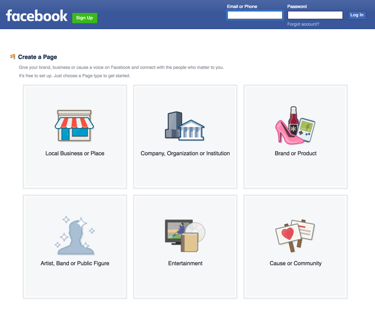
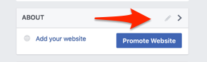
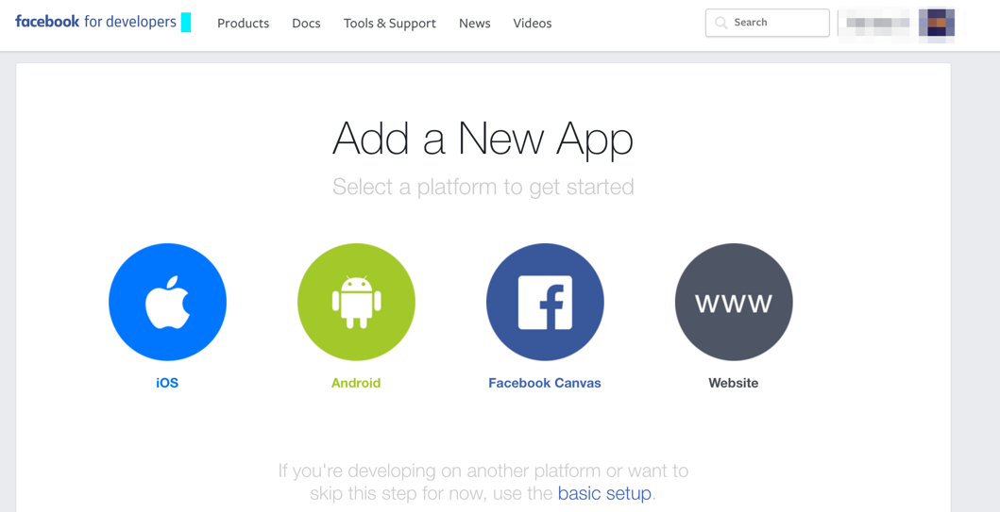
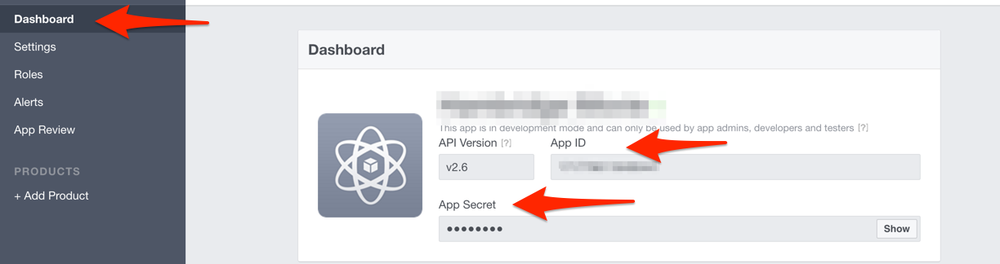
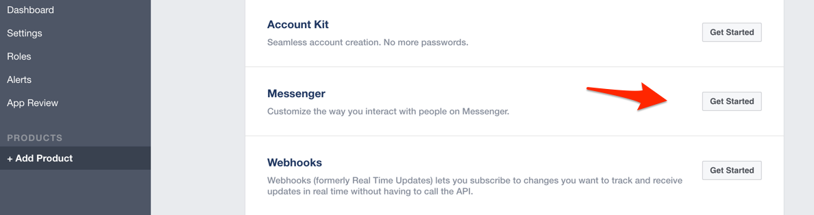
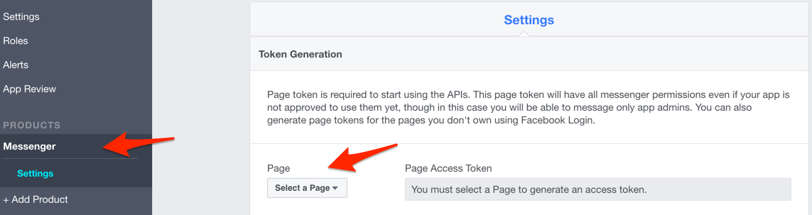

# Facebook Messenger chat integration setup

If you want to use Facebook Messenger to communicate with the the bot get started with the following steps:

## Get a Facebook Credentials for the bot

- [Create a Facebook Page](https://www.facebook.com/pages/create/)

	- Navigate to the "About" section in your page and find your `FB_PAGE_ID` in the bottom
		
		

- [Create a Facebook App](https://developers.facebook.com/quickstarts/?platform=web)

	- Copy your `FB_APP_ID` and `FB_APP_SECRET` from the app's dashboard
    

	- Go to your app settings and, under Product Settings, click "Add Product." Select "Messenger."
    
	- Select your page and generate an access token `FB_PAGE_TOKEN`
    
