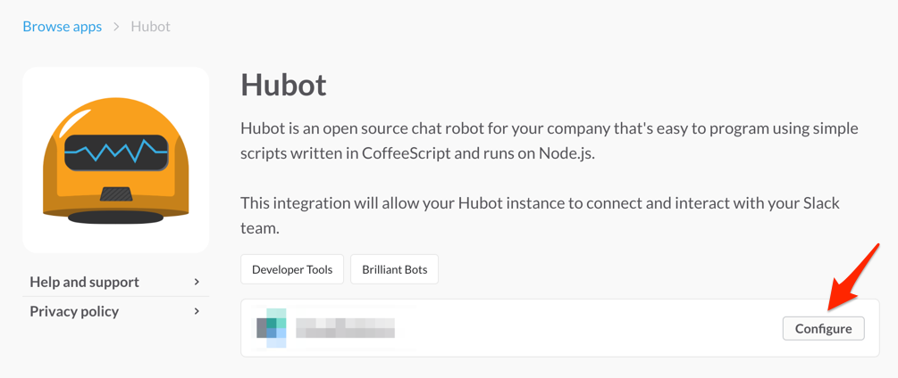
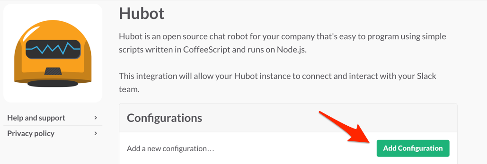
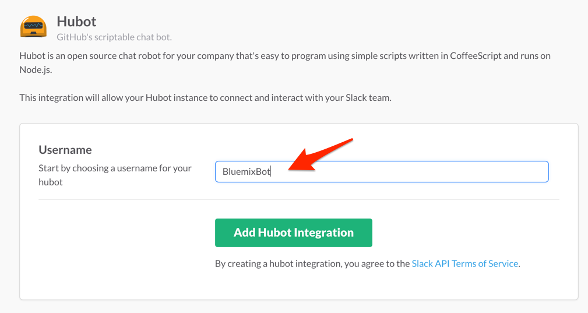
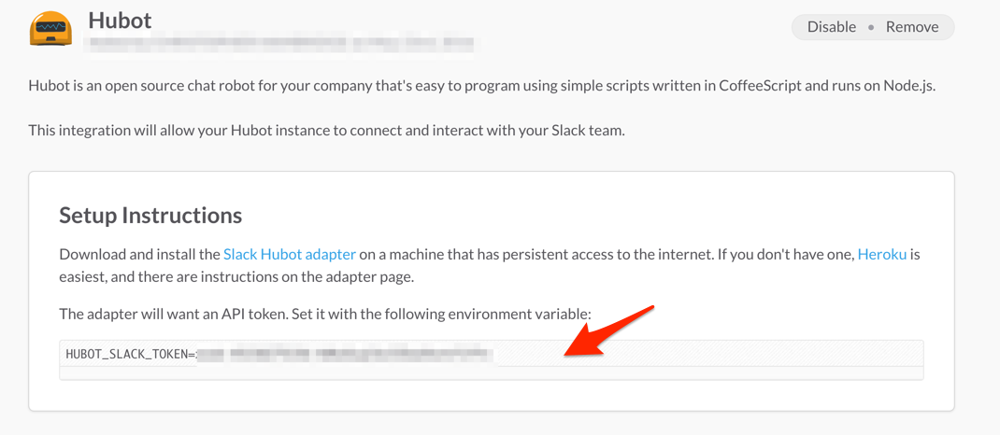
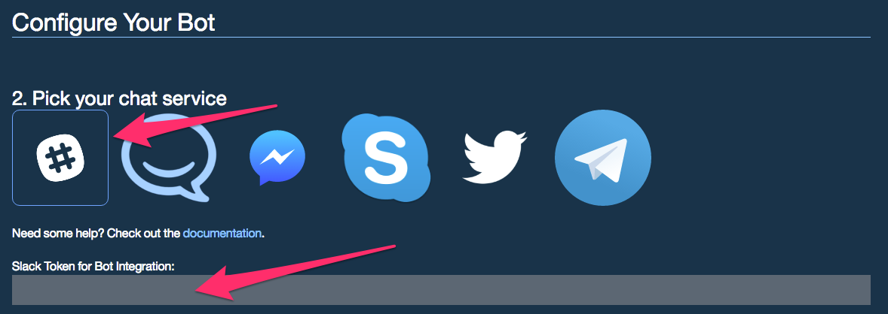

# Slack chat integration setup

If your team uses Slack for its communications you can add the bot with the following steps:

## Get a Slack token for the bot

In order to obtain a Slack token you must be an __Admin__ or have __Integration__ privileges on Slack. If you do not have this permission contact your local administrator for help.

To add your bot and obtain the necessary Slack token first point your browser to Slack Apps - `https://<your-slack>.slack.com/apps`.

Type *Hubot* the search bar and select the Hubot app. Once you have selected the application you should have a selection to configure the bot.

Once you have chosen to configure the bot choose *Add Configuration ...*

Now provide a name for your bot integration like __BluemixBot__.

After this step you will be provided with the Slack token your bot can use to communicate with your team.

## Configure Your Bot

To configure your bot for Slack chat integration, select the Slack icon and supply the Slack token in the field for *Slack Token for Bot Integration:*

